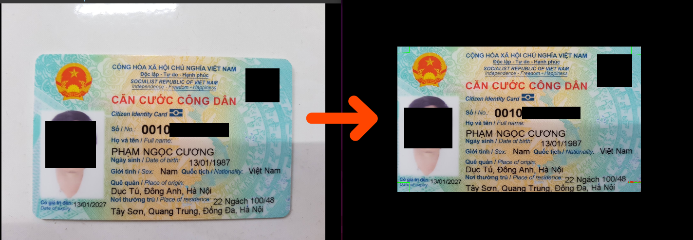
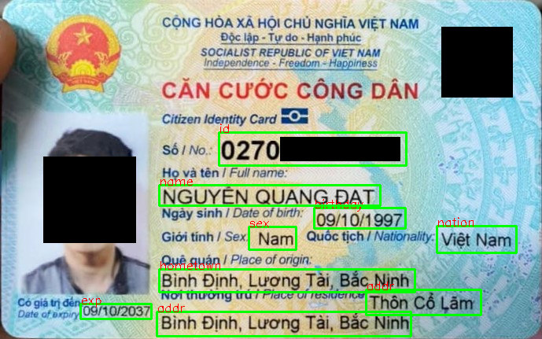
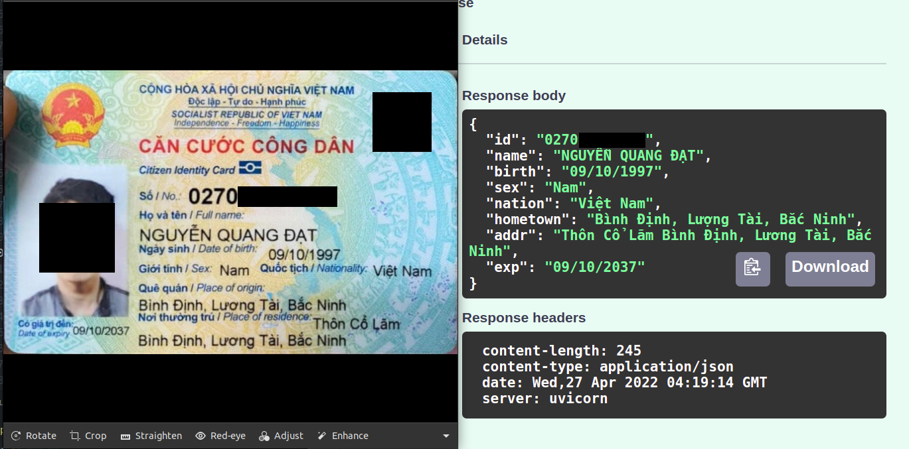

# OCR-ID-Card
extract information values in id card, citizen identity card, passport, ...

## Task
### Corner detection task


Detect 4 corners of the id card, passport,… then crop the image. That makes the word detection task easier (reduce noise, variances, …)
In this task, using SSD MobileNet v2 to detect corners. SSD has fast inference speed, MobileNet v2 uses low memory, operations but still has good accuracy
### Text detection task


Detect some information likely id, name, birthday, …  to cropping then use that to extract information task.
In this task, using SSD like detect corner task but using Resnet FPN for feature extractor
### Extract information task


Extract, get word from the image was cropped from word detection task.
Using vietOCR to extract information on images. VietOCR is a pre-trained Vietnamese model that was trained on 10m images. 
[GitHub - pbcquoc/vietocr: Transformer OCR](https://github.com/pbcquoc/vietocr) 
## Run Locally (python3.9.7)

Clone the project

```bash
  git clone https://github.com/whoisltd/OCR-ID-Card.git
```

Go to the project directory

```bash
  cd OCR-ID-Card
```

Install packages

```bash
  pip install -r requirements.txt
```

Start the server

```bash
  python3 main.py
```

# Updating ...
